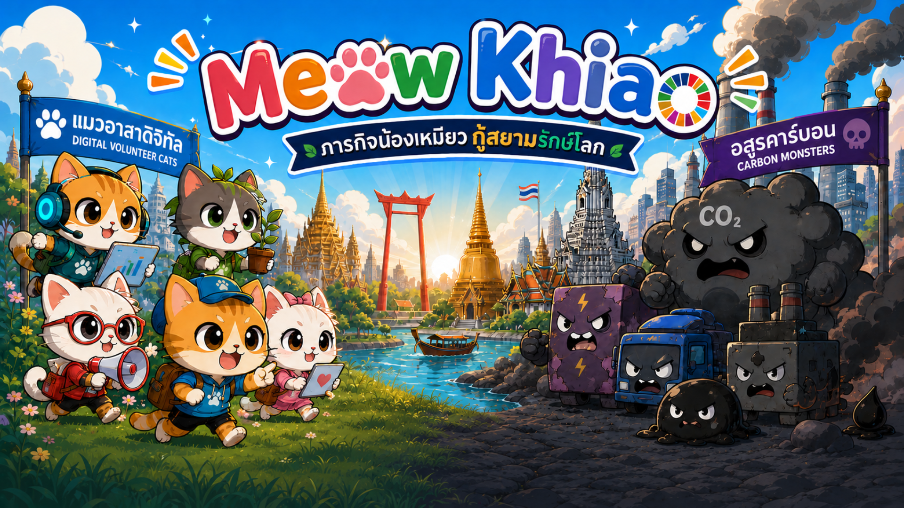
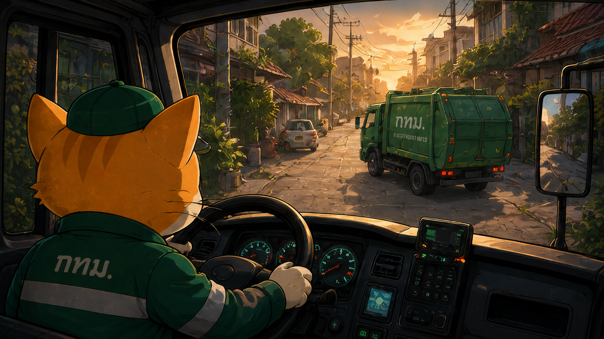
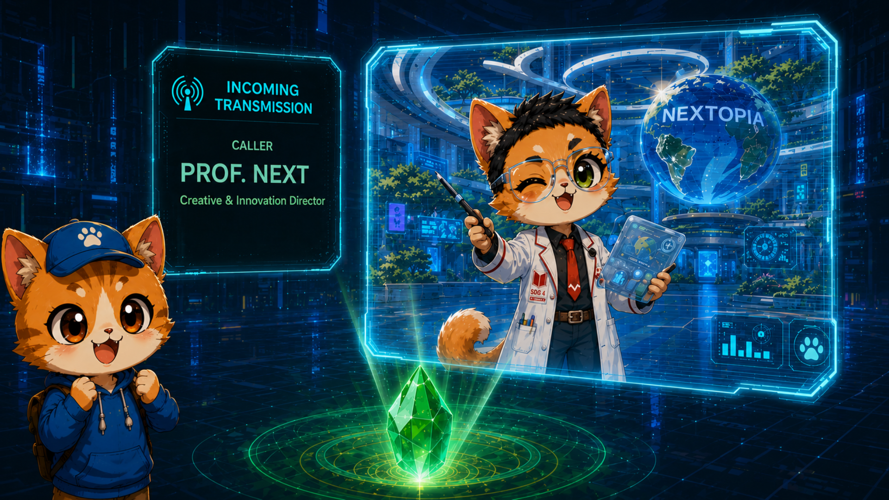
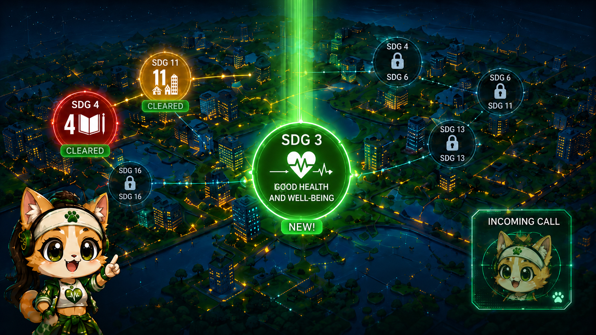
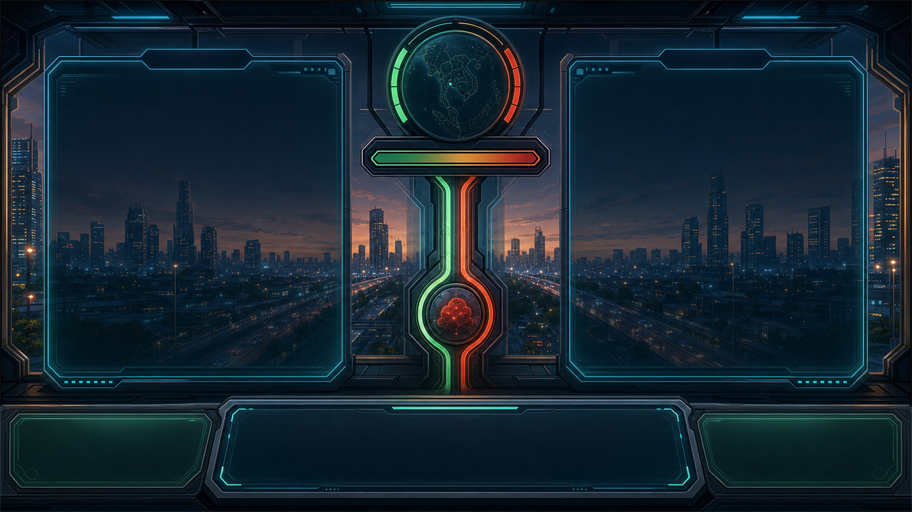
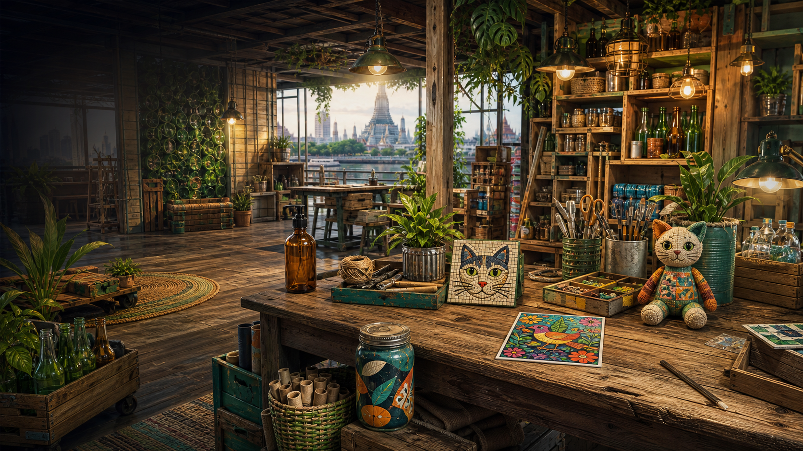
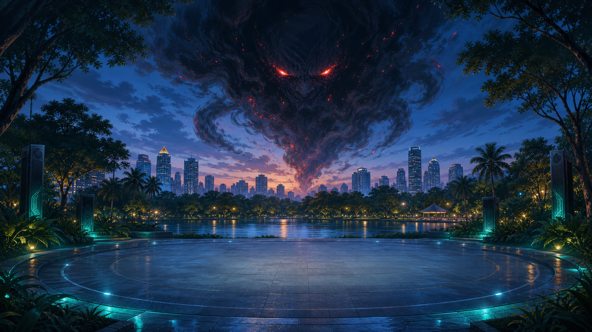

# Meow Khiao — แมวอาสาดิจิทัล 🐱🌏

เกม Visual Novel เชิงการเรียนรู้ (Game-Based Learning) สร้างด้วย **Ren'Py 8.5.3**
ผู้เล่นรับบทอาสาสมัครแมวผู้พิทักษ์กรุงเทพมหานครจำลอง ปราบ "อสูรคาร์บอน" (Carbon Monster)
ผ่านภารกิจตามเป้าหมายการพัฒนาที่ยั่งยืน (SDGs) 3 ด่าน พร้อมมินิเกมประจำด่าน

<p align="center"></p>

---

## ⬇️ สำคัญ: ต้องดาวน์โหลดไฟล์วิดีโอก่อนเล่น

ไฟล์วิดีโอ 4 ไฟล์ (รวม ~1.7 GB) **ไม่ได้เก็บไว้ใน GitHub** เพราะเกินลิมิตขนาดไฟล์
ต้องดาวน์โหลดแยกจาก OneDrive แล้วนำไปวางในโฟลเดอร์ที่กำหนด มิฉะนั้นเกมจะเล่นได้
แต่คัตซีนวิดีโอจะข้ามไป (เกมออกแบบให้ไม่ crash หากไม่มีไฟล์วิดีโอ)

**📥 ดาวน์โหลดวิดีโอทั้งหมด (OneDrive):** `<<< วางลิงก์ OneDrive ที่นี่ >>>`

หลังดาวน์โหลด ให้วางไฟล์ตามตำแหน่งนี้ (ชื่อไฟล์และโฟลเดอร์ต้องตรงเป๊ะ):

| ไฟล์วิดีโอ | ขนาด | วางไว้ที่ |
|---|---|---|
| `RAMA_4_ROAD.ogv` | 971 MB | `game/videos/1-RAMA_4_ROAD/` |
| `NEXTOPIA.ogv` | 505 MB | `game/videos/2-NEXTOPIA/` |
| `THAIHEALTH_SUEB_SANG_SOOK.ogv` | 129 MB | `game/videos/0-COMMON/` |
| `LUMPINI.ogv` | 86 MB | `game/videos/3-LUMPINI_WELLNESS_QUEST/` |

> ในแต่ละโฟลเดอร์มีไฟล์ `PLACE_VIDEO_HERE.txt` กำกับไว้ว่าต้องวางวิดีโอไฟล์ใด

---

## 🇬🇧 Overview (English Summary)

**Meow Khiao** is an educational visual novel built with Ren'Py 8.5.3 (Python).
Players join a digital cat-volunteer corps defending a simulated Bangkok from the
Carbon Monster, whose HP is tied to the city's carbon footprint. The game teaches
Sustainable Development Goals through three stages, each pairing a story chapter
with an original minigame:

| Stage | SDG | Minigame |
|---|---|---|
| 1 — RAMA 4 ROAD | SDG 11 (Sustainable Cities) | Waste-sorting: 25 items, 4 bin types, 5 houses, real-time timer |
| 2 — NEXTOPIA | SDG 4 (Quality Education) | Five hidden-object missions with checklist, timer, search energy and hints |
| 3 — LUMPINI WELLNESS QUEST | SDG 3 (Good Health) | Four-lane rhythm battle (PERFECT/GREAT/GOOD, combo, HP-based scoring) |

Shared systems include a Sustainability Decision mechanic (eco choice = −5,000 monster HP,
polluting choice = +5,000 HP plus a 250 Meow Coin carbon tax), a central reward ledger
(SDG badges, Meow Coins, Eco Score — claimable once per stage), a command-center Lobby
with live databases, and a post-stage learning flow that plays real-location videos and
links to Thai government/public-health programs. Runs on Windows/macOS/Linux via the
Ren'Py launcher; all UI text is in Thai.

---

## 1. รายละเอียดของการพัฒนา

### 1.1 เนื้อเรื่องย่อ (Story Board)

ในกาแล็กซีอันไกลโพ้น เผ่าพันธุ์แมวทรงภูมิปัญญา "Bastian" สร้างโลกจำลองที่ถอดแบบจาก
กรุงเทพมหานครยุคปัจจุบัน เพื่อใช้ทดลองแก้ปัญหาสิ่งแวดล้อมโดยมีเป้าหมาย Net Zero ภายในปี 2050
ทว่าเมืองจำลองกำลังถูก "อสูรคาร์บอน" รุกราน — พลังชีวิต (HP) ของมันผูกอยู่กับ carbon footprint
ของทั้งดาว ผู้เล่นในฐานะแมวอาสาดิจิทัลต้องพิชิตภารกิจ SDGs เพื่อลดคาร์บอนและปราบอสูรให้สำเร็จ

| | |
|---|---|
|  |  |
| ฉากเปิดเรื่อง | อสูรคาร์บอน ศัตรูหลักของเกม |

**ด่านที่ 1 — RAMA 4 ROAD (SDG 11: เมืองและชุมชนที่ยั่งยืน)**
CATLOARD มอบภารกิจแรก: ช่วยชุมชนถนนพระราม 4 จัดการขยะ ผู้เล่นขับรถเก็บขยะแยกประเภท
เข้าเยี่ยม 5 บ้าน แยกขยะจริง 25 ชิ้นลงถัง 4 ประเภท (อินทรีย์/รีไซเคิล/ทั่วไป/อันตราย)
ภายในเวลาจำกัด จบด่านด้วยวิดีโอสถานที่จริงและโครงการ "ไม่เทรวม" ของ กทม.

**ด่านที่ 2 — NEXTOPIA (SDG 4: การศึกษาที่มีคุณภาพ)**
เมืองแห่งการเรียนรู้อนาคตของ PROF.NEXT ผู้เล่นตามหาวัตถุที่ซ่อนอยู่ใน 5 ภารกิจ
(Waste to Wonder, Food Rescue, Harmonious Nature, Collective Clean Energy, Future Knowledge)
ผ่านแต่ละภารกิจจะลด HP อสูรคาร์บอนลง 20% จนครบ 5 เกม HP เป็นศูนย์พอดี
จบด่านด้วยวิดีโอและแหล่งเรียนรู้ของ อว./สถาบันเทคโนโลยีจิตรลดา

**ด่านที่ 3 — LUMPINI WELLNESS QUEST (SDG 3: สุขภาพและความเป็นอยู่ที่ดี)**
LUMI ชวนฟื้นฟูสวนลุมพินีให้เป็นพื้นที่สุขภาวะ ผู้เล่นประลองจังหวะดนตรี 4 เลนจนจบเพลง
คะแนนที่ทำได้คือความเสียหายต่ออสูรคาร์บอน โดยเกณฑ์ผ่านอิงผลจาก Sustainability Decision
จบด่านด้วยวิดีโอสถานที่จริง วิดีโอนิทรรศการ "สืบสร้างสุข" และข้อมูล สสส. ก่อนกลับสู่ Lobby

| | | |
|---|---|---|
|  |  |  |
| Story Board ด่านที่ 1 | Story Board ด่านที่ 2 | Story Board ด่านที่ 3 |

ระหว่างด่านทั้งหมดมี **หน้า Sustainability Decision** ให้ผู้เล่นเลือกแนวทาง (เป็นมิตรต่อสิ่งแวดล้อม
หรือปล่อยคาร์บอนสูง) ซึ่งส่งผลต่อ HP อสูร, ภาษีคาร์บอน และรางวัล และมี **Lobby ศูนย์บัญชาการ**
รวมฐานข้อมูล Inventory, ความคืบหน้าภารกิจ, ความรู้ SDG ทั้ง 17 ข้อ, Badge / Meow Coin / Eco Score

| | | |
|---|---|---|
|  |  |  |
| หน้า Sustainability Decision | ฉาก Hidden Object (NEXTOPIA) | สนามประลองจังหวะ (LUMPINI) |

### 1.2 ทฤษฎี หลักการ และเทคนิค/เทคโนโลยีที่ใช้

**หลักการออกแบบ**
- **Game-Based Learning / Edutainment** — ผูกเนื้อหา SDG 3, 4, 11, Net Zero, Carbon Footprint
  และ Carbon Credit เข้ากับกลไกเกมที่ให้ผลป้อนกลับทันที (คะแนน, HP, คำอธิบายรายชิ้น)
- **Consequence-Based Decision** — ระบบตัดสินใจด้านความยั่งยืนที่มีผลจริงต่อค่าในเกม
  (HP ±5,000, ภาษีคาร์บอน 250 Meow Coin) เพื่อสะท้อนต้นทุนของการปล่อยคาร์บอน
- **เชื่อมโยงโลกจริง (Real-World Connection)** — จบทุกด่านด้วยวิดีโอสถานที่จริงในกรุงเทพฯ
  และลิงก์หน่วยงานจริง (กทม. "ไม่เทรวม", อว./CDTI, สสส.)

**Algorithms และโครงสร้างข้อมูลที่ใช้**
- **Rhythm Beatmap Scheduling (ด่าน 3)** — สร้างตารางโน้ตจากค่าวิเคราะห์เพลงจริง
  (BPM 192, beat offset 0.137 วินาที, ความยาว 30.746 วินาที) จับเวลาด้วยตำแหน่งเพลงจริง
  (`renpy.music.get_pos`) แล้วตัดสิน PERFECT/GREAT/GOOD จากหน้าต่างเวลา (timing window)
  พร้อมตัวคูณคอมโบ — ต้องเล่นจนจบเพลงจึงสรุปผล
- **Random Shuffle แบ่งกลุ่ม (ด่าน 1)** — ค้นหาไฟล์ขยะจริงทั้งหมดด้วย `renpy.list_files()`
  สุ่มลำดับด้วย `renpy.random.shuffle()` แล้วแบ่ง 25 ชิ้นออกเป็น 5 บ้าน (list partitioning)
  ตรวจคำตอบด้วย metadata dictionary (ชื่อ, ประเภทถัง, คำอธิบายเชิงความรู้รายชิ้น)
- **State Machine ต่อภารกิจ (ด่าน 2)** — แต่ละเกมซ่อนวัตถุมี checklist เป้าหมาย, เวลาถอยหลัง,
  Search Energy และระบบ Hint; ผ่านเกมจะหัก HP = 20% ของ HP หลังการตัดสินใจ (ครบ 5 เกม = 0)
- **Claim Ledger กันรางวัลซ้ำ (ระบบกลาง)** — บันทึกการรับ Badge/Coin/Eco Score เป็น dictionary
  ต่อด่าน รับได้ครั้งเดียว โหลดเซฟเก่าแล้วระบบ migrate ค่าย้อนหลังให้โดยไม่แจกซ้ำ
- **Defensive State Repair** — `_mk_ensure_state()` ตรวจและซ่อมชนิดข้อมูลของ state กลาง
  ทุกครั้งที่โหลดเซฟ เพื่อรองรับเซฟจากเวอร์ชันเก่า
- **Graceful Fallback** — ทุกไฟล์สื่อสำคัญเช็กด้วย `renpy.loadable()` ก่อนใช้งาน
  ไฟล์หาย = แสดงหน้าแจ้งเตือน/พื้นสีแทน ไม่ทำให้เกม crash

### 1.3 เครื่องมือที่ใช้ในการพัฒนา

| ประเภท | เครื่องมือ |
|---|---|
| เอนจินเกม | Ren'Py 8.5.3 (Python 3, Screen Language, ADV system) |
| ภาษาที่ใช้เขียน | Ren'Py Script (.rpy) + Python (logic ภายใน `init python`) |
| โปรแกรมแก้ไขโค้ด | Visual Studio Code |
| ภาพประกอบ/ฉาก | สร้างด้วยเครื่องมือ Generative AI ตาม prompt ที่ทีมออกแบบ แล้วคัดเลือก/ตกแต่งเอง |
| เสียงเพลงประกอบ | เพลงประกอบต้นฉบับของโปรเจกต์ (BGM ประจำด่าน + เพลงมินิเกมจังหวะ) |
| วิดีโอ | ตัดต่อเป็น Theora (.ogv) เพื่อเล่นผ่าน `renpy.movie_cutscene()` |
| ฟอนต์ | TH Sarabun (`game/fonts/THSarabun.ttf`) รองรับภาษาไทยทั้งเกม |
| ควบคุมเวอร์ชัน | Git / GitHub |

### 1.4 รายละเอียดโปรแกรมเชิงเทคนิค (Software Specification)

#### Input Specification
- เมาส์ / ทัชสกรีน — เลือกเมนู, ลาก/คลิกแยกขยะ, คลิกหาวัตถุ, กดปุ่มเลนจังหวะ
- คีย์บอร์ด — ปุ่มเลนมินิเกมจังหวะ 4 เลน, ทางลัดมาตรฐาน Ren'Py (ESC, Ctrl skip ฯลฯ)
- คอนโทรลเลอร์ — รองรับผ่านระบบ input ของ Ren'Py (หน้า Tutorial ระบุปุ่มครบทุกอุปกรณ์)

#### Output Specification
- ภาพ: หน้าจอเกมความละเอียดอ้างอิง 1920×1080 (ปรับสเกลอัตโนมัติ)
- เสียง: BGM ประจำด่าน, เพลงมินิเกม, เอฟเฟกต์ (ผ่าน audio channel ของ Ren'Py)
- วิดีโอ: คัตซีน .ogv 4 ไฟล์ (ดู/ข้าม/ดูซ้ำได้)
- ไฟล์เซฟ: `%APPDATA%/RenPy/MeowKhiao/` (Windows) เก็บความคืบหน้า, รางวัล, การตัดสินใจ

#### Functional Specification
| ระบบ | หน้าที่ |
|---|---|
| Story Flow | เล่าเรื่องด้วย scene + Character Say ตามมาตรฐาน Ren'Py ทั้ง 3 ด่าน |
| Sustainability Decision | เลือกแนวทางก่อนมินิเกม บันทึกครั้งเดียวต่อด่าน มีผลต่อ HP/ภาษี/รางวัล |
| Minigame ด่าน 1 | แยกขยะ 25 ชิ้น 5 บ้าน มี HUD, เวลาถอยหลัง, การ์ดความรู้หลังวางขยะ |
| Minigame ด่าน 2 | Hidden object 5 เกม มี checklist, timer, search energy, hint, retry |
| Minigame ด่าน 3 | Rhythm 4 เลน มี HP monster, combo, lane flash, หน้า pause/result |
| Learning Flow | หลังจบด่าน เล่นวิดีโอสถานที่จริง + หน้าเชื่อมโยงนโยบายรัฐ (ลิงก์เปิดเมื่อกดเท่านั้น) |
| Lobby | ฐานข้อมูลสด 5 โมดูล: Inventory, Learning Connection, Progression, SDG Knowledge, Achievement |
| ระบบรางวัลกลาง | SDG Badge + 200 Meow Coin + 150 Eco Score ต่อด่าน ผ่าน claim ledger กันรับซ้ำ |

#### โครงสร้างของซอฟต์แวร์ (Design)

```
script.rpy (จุดเริ่ม + ฉากเปิด)
   └─> rama4.rpy (ด่าน 1: เนื้อเรื่อง + มินิเกมแยกขยะ)
          └─> nextopia.rpy (ด่าน 2: เนื้อเรื่อง + hidden object 5 เกม)
                 └─> lumpini.rpy (ด่าน 3: เนื้อเรื่อง + rhythm battle)
                        └─> lobby.rpy (ศูนย์บัญชาการ / จบเกม)

ระบบกลางที่ทุกด่านเรียกใช้:
  sustainability_core.rpy   การตัดสินใจ + HP + เหรียญ/แต้ม/Badge + claim ledger
  learning_connections.rpy  วิดีโอสถานที่จริง + หน้าเชื่อมโยงนโยบาย (ทุกด่าน)
  lumpini_video.rpy         จุดเข้าวิดีโอแบบเก่า (ส่งต่อให้ learning flow กลาง)
  screens.rpy               นามแฝงภาพทุกด่าน + UI มาตรฐาน Ren'Py
  gui.rpy / options.rpy     ฟอนต์ไทย, เมนูหลัก, ค่าคอนฟิกโปรเจกต์
```

โครงสร้างไฟล์ asset แยกหมวดหมู่และแบ่งตามด่านชัดเจน:

```
game/
├── audio/                    เพลงประกอบเนื้อเรื่อง แบ่งตามด่าน
│   ├── 0-COMMON/             (เพลงเมนูหลัก)
│   ├── 1-RAMA_4_ROAD/  ├── 2-NEXTOPIA/  └── 3-LUMPINI_WELLNESS_QUEST/
├── images/
│   ├── story/                ภาพเนื้อเรื่อง (Story Board) แบ่งตามด่าน 1 / 2 / 3
│   ├── characters/           ตัวละครที่ใช้ร่วมทุกด่าน
│   ├── lobby/                ภาพหน้า Lobby
│   └── sustainability/       พื้นหลังหน้า Sustainability Decision
├── minigames/                ไฟล์มินิเกม แบ่งตามด่าน (ภายในแยก images/ และ audio/)
│   ├── 1-RAMA_4_ROAD/images/{garbage, bins, backgrounds, tutorial}
│   ├── 2-NEXTOPIA/images/{scenes, tutorial}
│   └── 3-LUMPINI_WELLNESS_QUEST/{audio, images/{backgrounds, tutorial}}
├── videos/                   โครงสร้างโฟลเดอร์วิดีโอ (ไฟล์ .ogv ดาวน์โหลดจาก OneDrive)
├── fonts/                    ฟอนต์ TH Sarabun
├── gui/                      ธีม UI มาตรฐาน Ren'Py (ปุ่ม, กรอบ, เมนู)
└── *.rpy                     สคริปต์เกมทั้งหมด
```

#### ส่วนที่ทีมพัฒนาขึ้นเอง และแหล่งที่มาของโค้ดอื่น
- **พัฒนาเอง:** โค้ดเกมทั้งหมดใน `game/*.rpy` — ระบบด่านทั้ง 3, มินิเกมทั้ง 3 แบบ,
  ระบบ Sustainability/รางวัลกลาง, Lobby, Learning Flow และ UI (ด่าน 1 พอร์ตมาจาก
  ต้นแบบ React/TypeScript ที่ทีมพัฒนาเองในดราฟต์ก่อนหน้า)
- **แหล่งอ้างอิงภายนอก:**
  - เอนจิน Ren'Py และเทมเพลตมาตรฐาน (`screens.rpy`, `gui.rpy`, `options.rpy`) — © Ren'Py (renpy.org)
  - แนวคิดมินิเกมจังหวะศึกษาจากโปรเจกต์โอเพนซอร์ส **renpy-rhythm** (RuolinZheng08 บน GitHub)
    โดยทีมเขียนระบบขึ้นใหม่ทั้งหมดให้เข้ากับกลไก HP/คอมโบ/บทเรียนของเกม
  - วิดีโอนิทรรศการ "สืบสร้างสุข" — สำนักงานกองทุนสนับสนุนการสร้างเสริมสุขภาพ (สสส.)
    ใช้เพื่อการศึกษา พร้อมลิงก์อ้างอิง https://www.thaihealth.or.th/about-thaihealth
  - ฟอนต์ TH Sarabun — ฟอนต์มาตรฐานราชการไทย (โครงการฟอนต์แห่งชาติ SIPA)

### 1.5 ขอบเขตและข้อจำกัดของโปรแกรม
- มีด่านที่เล่นได้จริง 3 ด่าน (SDG 11, 4, 3) จากแผนเนื้อเรื่อง 17 SDGs — ด่านที่เหลือเป็นแผนพัฒนาต่อ
- รองรับภาษาไทยเป็นหลัก (UI และเนื้อเรื่องทั้งหมดเป็นภาษาไทย)
- เป็นเกมเล่นคนเดียวแบบออฟไลน์ ลิงก์ความรู้ภายนอกเปิดผ่านเบราว์เซอร์ของผู้ใช้เมื่อกดปุ่มเท่านั้น
- วิดีโอใช้รูปแบบ Theora (.ogv) ตามที่ Ren'Py รองรับบนเดสก์ท็อป
- ไฟล์วิดีโอ (~1.7 GB) จัดเก็บแยกบน OneDrive ไม่รวมใน Git repo — ต้องดาวน์โหลดเพิ่มก่อนเล่น
- ความคืบหน้า/รางวัลผูกกับไฟล์เซฟในเครื่อง (หนึ่งโปรไฟล์ต่อผู้ใช้ระบบปฏิบัติการ)

### 1.6 คุณลักษณะของอุปกรณ์ที่ใช้กับโปรแกรม
- ระบบปฏิบัติการ: Windows 10 ขึ้นไป (64-bit), macOS หรือ Linux ที่ Ren'Py 8.5 รองรับ
- หน่วยความจำ: RAM 2 GB ขึ้นไป, พื้นที่ดิสก์ว่างประมาณ 500 MB
- การแสดงผล: รองรับ OpenGL 2 / DirectX (ANGLE) ความละเอียดแนะนำ 1920×1080
- อุปกรณ์ควบคุม: เมาส์และคีย์บอร์ด (รองรับทัชสกรีนและคอนโทรลเลอร์)

---

## 2. วิธีติดตั้งและรันเกม (สำหรับนักพัฒนา)

1. ดาวน์โหลด [Ren'Py SDK 8.5.3](https://www.renpy.org/latest.html) และติดตั้ง
2. Clone โปรเจกต์นี้ไว้ในโฟลเดอร์ Projects ของ Ren'Py (หรือชี้ Launcher มาที่โฟลเดอร์นี้)
   ```
   git clone <URL ของ repository นี้>
   ```
3. **ดาวน์โหลดไฟล์วิดีโอจาก OneDrive** (ดูหัวข้อ "ต้องดาวน์โหลดไฟล์วิดีโอก่อนเล่น" ด้านบน)
   แล้ววางลงโฟลเดอร์ `game/videos/` ตามตารางที่กำหนด
4. เปิด Ren'Py Launcher → เลือกโปรเจกต์ **Meow Khiao** → กด **Launch Project**
4. (ตรวจสอบโค้ด) กด **Check Script (Lint)** ใน Launcher เพื่อตรวจ error ก่อน build
5. (สร้างตัวติดตั้ง) กด **Build Distributions** เลือกแพลตฟอร์มที่ต้องการ

> หมายเหตุ: ไฟล์ `.rpyc`, `saves/`, `cache/` ไม่ถูก commit ขึ้น Git (ดู `.gitignore`)
> Ren'Py จะสร้างให้ใหม่อัตโนมัติเมื่อรันครั้งแรก

---

*โปรเจกต์นี้พัฒนาเพื่อการศึกษา เผยแพร่เนื้อหาความรู้ด้านความยั่งยืน อ้างอิงข้อมูลจริงจาก
กรุงเทพมหานคร, กระทรวง อว., สถาบันเทคโนโลยีจิตรลดา และ สสส.*
